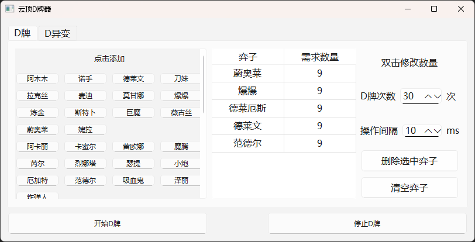
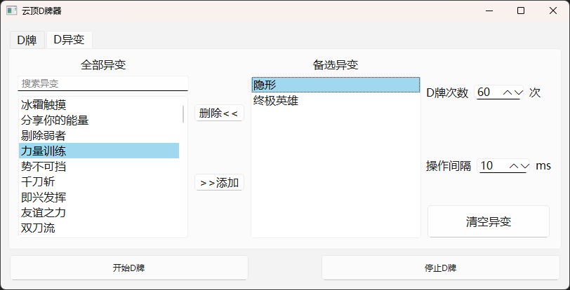

# 云顶之弈 D 牌助手

一款帮助云顶之弈玩家快速寻找所需棋子和异变的辅助工具。




## 注意

- 支持分辨率1920 X 1080
- 游戏以无边框或窗口运行
- Shift+S 停止D牌（需管理员模式运行）
- 游戏延迟过高克尝试增加操作间隔
- 使用D牌功能请将所有需要的棋子加入备选
- 因为是图像识别，可能会有漏牌的现象（目前未观察到）

## 环境要求

- Python 3.10
- Windows 10/11 x64

## 安装步骤

1. 克隆项目
```bash
git clone https://github.com/yourusername/tft-roll.git
cd tft-roll
```

2. 安装依赖
```bash
pip install -r requirements.txt
```
## 使用说明

1. 运行程序
```bash
python main.py
```

2. 操作流程：
- 点击左上角悬浮窗"D"按钮打开主界面
- 在左侧选择所需棋子或变异添加到列表
- 设置D牌次数
- 点击"开始D牌"按钮
- 使用 Shift+S 或点击"停止D牌"按钮结束D牌

## 项目结构

* 📁 src/ - 源代码目录  
  * 📄 main.py - 程序入口
  * 📄 ui.py - 界面实现
  * 📄 roll.py - D牌逻辑
* 📁 ui/ - UI文件目录
  * 📄 roll.ui - Qt Designer UI文件
* 📄 LICENSE - 许可证文件
* 📄 README.md - 项目说明文档
* 📄 requirements.txt - 项目依赖

## 许可证

MIT License
